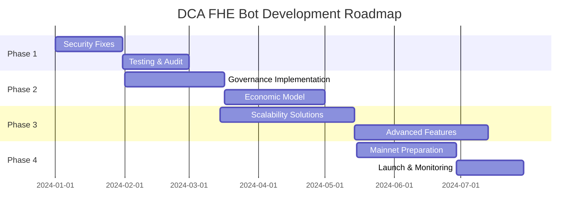

# DCA FHE Bot 改进路线图

## 执行概要

本路线图为DCA FHE Bot系统提供了从MVP到生产级应用的完整演进计划。路线图分为四个主要阶段，预计总时长6-9个月。

## 📅 发展阶段概览



## 🚀 第一阶段：安全加固（1-2个月）

### 目标
修复所有关键安全漏洞，建立坚实的安全基础

### 1.1 Week 1-2: 关键漏洞修复

#### 实施清单
- [ ] **FHE解密集成**
  ```solidity
  // 集成Zama Gateway
  interface IZamaGateway {
      function requestDecryption(euint64 value) external returns (uint256);
      function getDecryptionResult(uint256 id) external view returns (uint256);
  }
  ```

- [ ] **零知识证明系统**
  - 集成Groth16或PLONK证明系统
  - 实施余额证明电路
  - 部署验证器合约

- [ ] **移除测试代码**
  - 创建独立的测试合约
  - 实施编译标志分离

### 1.2 Week 3-4: 安全增强

- [ ] **多签名钱包部署**
  ```solidity
  contract DCAGovernance {
      address public multiSigWallet; // Gnosis Safe
      uint256 public constant TIMELOCK = 48 hours;
      
      modifier onlyMultiSig() {
          require(msg.sender == multiSigWallet, "Only multisig");
          _;
      }
  }
  ```

- [ ] **访问控制升级**
  ```solidity
  import "@openzeppelin/contracts/access/AccessControl.sol";
  
  contract RoleBasedDCA is AccessControl {
      bytes32 public constant OPERATOR_ROLE = keccak256("OPERATOR");
      bytes32 public constant GUARDIAN_ROLE = keccak256("GUARDIAN");
      bytes32 public constant PAUSER_ROLE = keccak256("PAUSER");
  }
  ```

### 1.3 Week 5-6: 测试与审计

- [ ] **全面测试覆盖**
  - 单元测试 > 95%
  - 集成测试完整场景
  - 模糊测试关键函数

- [ ] **形式化验证**
  ```javascript
  // 使用Certora或Mythril
  invariant totalSupply == sum(balances)
  invariant batchSize >= MIN && batchSize <= MAX
  ```

- [ ] **第三方审计**
  - 选择审计公司（如Trail of Bits, ConsenSys Diligence）
  - 准备审计文档
  - 修复审计发现

### 1.4 Week 7-8: 监控系统

- [ ] **链上监控**
  ```javascript
  class DCAMonitor {
      async monitorBatchProcessing() {
          // 监控批处理事件
          contract.on("BatchProcessed", async (batchId, success) => {
              if (!success) {
                  await alertTeam("Batch failed", batchId);
              }
          });
      }
      
      async monitorPriceDeviations() {
          // 监控价格异常
          const deviation = calculatePriceDeviation();
          if (deviation > THRESHOLD) {
              await pauseSystem();
          }
      }
  }
  ```

- [ ] **告警系统**
  - Telegram/Discord机器人
  - PagerDuty集成
  - Grafana仪表板

## 🏛️ 第二阶段：去中心化治理（2-3个月）

### 目标
实施完全去中心化的治理机制和经济模型

### 2.1 Month 3: DAO基础设施

- [ ] **治理代币设计**
  ```solidity
  contract DCAToken is ERC20, ERC20Permit, ERC20Votes {
      uint256 public constant MAX_SUPPLY = 1_000_000_000 * 1e18;
      
      constructor() ERC20("DCA Gov", "DCAG") ERC20Permit("DCA Gov") {
          _mint(treasury, MAX_SUPPLY * 40 / 100);  // 40% 国库
          _mint(team, MAX_SUPPLY * 20 / 100);      // 20% 团队（锁定）
          _mint(rewards, MAX_SUPPLY * 30 / 100);   // 30% 奖励
          _mint(publicSale, MAX_SUPPLY * 10 / 100); // 10% 公售
      }
  }
  ```

- [ ] **Governor合约**
  ```solidity
  contract DCAGovernor is Governor, GovernorSettings {
      uint256 public constant VOTING_DELAY = 1 days;
      uint256 public constant VOTING_PERIOD = 1 weeks;
      uint256 public constant PROPOSAL_THRESHOLD = 10000e18; // 10k tokens
      uint256 public constant QUORUM = 4; // 4%
  }
  ```

### 2.2 Month 4: 经济模型

- [ ] **费用结构**
  ```solidity
  contract FeeManager {
      uint256 public constant PROTOCOL_FEE = 30; // 0.3%
      uint256 public constant PERFORMANCE_FEE = 1000; // 10% of profits
      
      struct FeeDistribution {
          uint256 treasury;    // 40%
          uint256 stakers;     // 30%
          uint256 lpProviders; // 20%
          uint256 team;        // 10%
      }
  }
  ```

- [ ] **质押机制**
  ```solidity
  contract StakingRewards {
      uint256 public rewardRate;
      uint256 public periodFinish;
      mapping(address => uint256) public rewards;
      
      function stake(uint256 amount) external {
          _totalSupply += amount;
          _balances[msg.sender] += amount;
          emit Staked(msg.sender, amount);
      }
      
      function getReward() external {
          uint256 reward = earned(msg.sender);
          rewards[msg.sender] = 0;
          rewardToken.transfer(msg.sender, reward);
      }
  }
  ```

- [ ] **激励设计**
  - 早期用户奖励
  - 流动性挖矿
  - 推荐计划

### 2.3 Month 5: 去中心化基础设施

- [ ] **IPFS集成**
  ```javascript
  class IPFSStorage {
      async storeStrategyMetadata(strategy) {
          const cid = await ipfs.add(JSON.stringify(strategy));
          return cid.path;
      }
      
      async retrieveStrategy(cid) {
          const stream = ipfs.cat(cid);
          return JSON.parse(stream);
      }
  }
  ```

- [ ] **预言机网络**
  - 多预言机聚合
  - 去中心化价格源
  - 故障转移机制

## ⚡ 第三阶段：扩展性与功能增强（2-3个月）

### 目标
提升系统性能，添加高级功能

### 3.1 Layer 2 集成

- [ ] **Optimism/Arbitrum部署**
  ```solidity
  contract L2BatchProcessor {
      IL1CrossDomainMessenger public messenger;
      
      function sendBatchToL1(BatchResult memory result) external {
          bytes memory message = abi.encode(result);
          messenger.sendMessage(
              l1Processor,
              message,
              1000000 // gas limit
          );
      }
  }
  ```

- [ ] **跨链桥接**
  ```solidity
  contract CrossChainBridge {
      mapping(uint256 => address) public remoteContracts;
      
      function bridgeIntent(
          uint256 targetChain,
          EncryptedIntent memory intent
      ) external {
          ILayerZero(lzEndpoint).send(
              targetChain,
              remoteContracts[targetChain],
              abi.encode(intent),
              msg.sender,
              address(0),
              bytes("")
          );
      }
  }
  ```

### 3.2 高级DCA策略

- [ ] **动态DCA**
  ```solidity
  contract AdvancedDCA {
      struct DynamicStrategy {
          euint64 baseAmount;
          euint64 multiplier;  // 基于市场条件的乘数
          euint32 adaptivePeriod; // 自适应周期
          bytes32 strategyHash;   // 策略哈希
      }
      
      function calculateDynamicAmount(
          DynamicStrategy memory strategy,
          uint256 marketCondition
      ) internal returns (euint64) {
          // RSI < 30: 增加购买量
          // RSI > 70: 减少购买量
          euint64 adjustment = FHE.mul(
              strategy.baseAmount,
              FHE.asEuint64(marketCondition)
          );
          return adjustment;
      }
  }
  ```

- [ ] **组合策略**
  ```solidity
  contract PortfolioDCA {
      struct Portfolio {
          address[] tokens;
          euint64[] allocations; // 加密的分配比例
          euint64 totalBudget;
      }
      
      function executePortfolioDCA(
          Portfolio memory portfolio
      ) external {
          for (uint i = 0; i < portfolio.tokens.length; i++) {
              euint64 tokenAmount = FHE.mul(
                  portfolio.totalBudget,
                  portfolio.allocations[i]
              );
              _executeDCA(portfolio.tokens[i], tokenAmount);
          }
      }
  }
  ```

### 3.3 高级隐私功能

- [ ] **混币器集成**
  ```solidity
  contract TornadoCashIntegration {
      ITornadoCash public tornado;
      
      function depositWithMixing(
          bytes32 commitment
      ) external payable {
          tornado.deposit{value: msg.value}(commitment);
      }
  }
  ```

- [ ] **隐私路由**
  ```solidity
  contract PrivacyRouter {
      function routeThroughRelayers(
          bytes memory encryptedData,
          address[] memory relayers
      ) external {
          // 通过多个中继器路由以增强隐私
          for (uint i = 0; i < relayers.length; i++) {
              IRelayer(relayers[i]).relay(encryptedData);
          }
      }
  }
  ```

## 🎯 第四阶段：主网准备与发布（1-2个月）

### 目标
完成主网部署准备并成功发布

### 4.1 主网准备

- [ ] **性能优化**
  ```solidity
  contract GasOptimized {
      // 使用assembly优化关键路径
      function efficientSwap() external {
          assembly {
              // 直接内存操作
              let data := mload(0x40)
              // ...
          }
      }
  }
  ```

- [ ] **压力测试**
  ```javascript
  describe("Stress Tests", function() {
      it("Should handle 1000 concurrent intents", async function() {
          const promises = [];
          for (let i = 0; i < 1000; i++) {
              promises.push(submitIntent());
          }
          await Promise.all(promises);
      });
  });
  ```

### 4.2 部署策略

- [ ] **分阶段部署**
  1. 部署核心合约（代理模式）
  2. 初始化治理
  3. 迁移测试网用户
  4. 逐步开放功能

- [ ] **风险管理**
  ```solidity
  contract RiskManager {
      uint256 public maxDailyVolume = 1_000_000 * 1e6; // 100万 USDC
      uint256 public maxBatchSize = 50;
      
      modifier withinLimits(uint256 amount) {
          require(dailyVolume[today()] + amount <= maxDailyVolume, "Daily limit exceeded");
          _;
      }
  }
  ```

### 4.3 发布后监控

- [ ] **KPI追踪**
  - TVL（总锁定价值）
  - 日活用户
  - 批处理成功率
  - Gas效率

- [ ] **持续改进**
  - 用户反馈收集
  - 性能优化
  - 新功能开发

## 📊 关键里程碑与KPI

### Q1 2024
- ✅ 完成安全审计
- ✅ 多签名治理上线
- ✅ 测试网稳定运行30天
- **KPI**: 0安全事件，99.9%正常运行时间

### Q2 2024
- DAO启动
- 代币发行
- L2部署
- **KPI**: 1000+活跃用户，$10M+ TVL

### Q3 2024
- 主网发布
- 跨链功能
- 高级策略
- **KPI**: 5000+用户，$50M+ TVL

### Q4 2024
- 生态系统扩展
- 机构集成
- 全球扩张
- **KPI**: 10000+用户，$100M+ TVL

## 🛠️ 技术债务管理

### 需要重构的区域

1. **BatchProcessor分离**
   ```solidity
   // 当前：单体合约
   // 目标：模块化架构
   contract BatchQueue { }
   contract PriceOracle { }
   contract SwapExecutor { }
   contract TokenDistributor { }
   ```

2. **存储优化**
   - 实施稀疏默克尔树
   - 使用IPFS存储元数据
   - 优化状态变量打包

3. **事件系统重构**
   - 标准化事件格式
   - 添加索引字段
   - 实施事件聚合

## 🎓 团队发展

### 技能需求

1. **即时需求**
   - ZK证明工程师
   - Solidity安全专家
   - DevOps工程师

2. **中期需求**
   - 产品经理
   - 社区经理
   - 业务发展

3. **长期需求**
   - 研究科学家
   - 机构销售
   - 合规专家

## 💰 预算估算

### 开发成本
- 安全审计: $50,000 - $100,000
- 开发团队(6个月): $300,000 - $500,000
- 基础设施: $20,000 - $30,000
- 法律合规: $30,000 - $50,000

### 营销与运营
- 社区建设: $50,000
- 营销活动: $100,000
- 流动性激励: $200,000

**总预算**: $750,000 - $1,030,000

## 🚦 风险与缓解

### 技术风险
- **FHE性能**: 持续优化，考虑混合方案
- **可扩展性**: L2集成，批处理优化
- **安全漏洞**: 多次审计，漏洞赏金

### 市场风险
- **竞争**: 差异化功能，用户体验
- **监管**: 法律咨询，合规设计
- **采用率**: 激励机制，教育内容

### 运营风险
- **团队扩张**: 逐步招聘，文化建设
- **资金**: 多轮融资，收入多元化

## 📈 成功指标

### 短期（3个月）
- [ ] 零安全事件
- [ ] 1000+ 测试网用户
- [ ] 99.9% 正常运行时间

### 中期（6个月）
- [ ] $10M+ TVL
- [ ] 5000+ 活跃用户
- [ ] 3+ 审计完成

### 长期（12个月）
- [ ] $100M+ TVL
- [ ] 10000+ 活跃用户
- [ ] 盈利能力实现

## 总结

DCA FHE Bot的成功需要在技术创新、安全性和用户体验之间取得平衡。通过遵循这个路线图，项目可以从MVP逐步发展成为行业领先的隐私保护DCA协议。关键是保持灵活性，根据市场反馈和技术发展调整策略。

---

**下一步行动**:
1. 组建核心团队
2. 确保种子资金
3. 开始第一阶段实施
4. 建立社区
5. 持续迭代改进