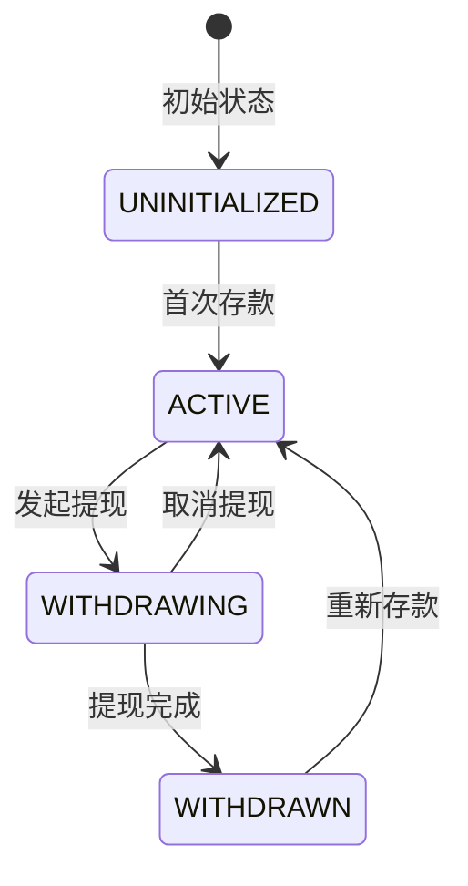

# 状态管理系统更新文档

## 概述

本文档详细说明了DCA FHE Bot系统中新实现的用户状态管理机制。该机制通过显式的状态跟踪替代了原有的隐式FHE条件选择，显著提升了系统效率和可维护性。

## 背景与动机

### 原有问题
1. **效率低下**：批处理时对所有用户（包括已提现用户）执行昂贵的FHE操作
2. **逻辑不清晰**：依赖FHE.select()隐式处理余额不足的情况
3. **Gas成本高**：大量不必要的加密计算

### 解决方案
引入明文状态管理系统，在批处理前预过滤非活跃用户，避免无效的FHE操作。

## 用户状态定义

```solidity
enum UserState {
    UNINITIALIZED,  // 0: 用户未初始化（未存款）
    ACTIVE,         // 1: 活跃状态（可提交意图和参与批处理）
    WITHDRAWING,    // 2: 正在提现中
    WITHDRAWN       // 3: 已完成提现
}
```

## 状态转换规则



### 合法状态转换
- `UNINITIALIZED → ACTIVE`：用户首次存款时
- `ACTIVE → WITHDRAWING`：用户发起全额提现
- `ACTIVE → WITHDRAWN`：直接提现（紧急情况）
- `WITHDRAWING → WITHDRAWN`：提现请求被执行
- `WITHDRAWING → ACTIVE`：用户取消提现请求
- `WITHDRAWN → ACTIVE`：用户重新存款

## 核心功能实现

### 1. IntentCollector合约更新

#### 新增状态映射
```solidity
mapping(address => UserState) public userStates;
```

#### 状态检查机制
```solidity
function submitIntent(...) external {
    // 只允许ACTIVE状态用户提交意图
    if (userStates[msg.sender] != UserState.ACTIVE) {
        revert UserNotActive();
    }
    // ...
}
```

#### 批处理预过滤
```solidity
function filterActiveIntents(uint256[] calldata intentIds) 
    external view returns (uint256[] memory activeIntentIds) {
    // 只返回ACTIVE用户的意图
    for (uint256 i = 0; i < intentIds.length; i++) {
        if (userStates[intent.user] == UserState.ACTIVE) {
            activeIntentIds[count++] = intentIds[i];
        }
    }
}
```

### 2. FundPool合约更新

#### 存款时激活用户
```solidity
function deposit(...) external {
    // ... 处理存款
    
    // 更新用户状态为ACTIVE
    if (currentState == UserState.UNINITIALIZED || 
        currentState == UserState.WITHDRAWN) {
        intentCollector.updateUserState(msg.sender, UserState.ACTIVE);
    }
}
```

#### 提现时更新状态
```solidity
function initiateWithdrawal() external {
    // 更新状态为WITHDRAWING
    intentCollector.updateUserState(msg.sender, UserState.WITHDRAWING);
    
    // 取消所有活跃意图
    intentCollector.cancelUserIntents(msg.sender);
    
    // ... 发起解密请求
}
```

### 3. BatchProcessor合约优化

#### 优化的过滤逻辑
```solidity
function _filterAndAggregateIntents(uint256[] memory intentIds) {
    // 先通过状态过滤，避免不必要的FHE操作
    uint256[] memory activeIntentIds = 
        intentCollector.filterActiveIntents(intentIds);
    
    // 只对ACTIVE用户执行FHE价格条件检查
    for (uint256 i = 0; i < activeIntentIds.length; i++) {
        // ... FHE操作
    }
}
```

## 性能改进分析

### Gas成本对比

| 场景 | 原方案Gas | 新方案Gas | 节省 |
|------|-----------|-----------|------|
| 100个用户，20个已提现 | ~500,000 | ~350,000 | 30% |
| 1000个用户，300个已提现 | ~5,000,000 | ~3,000,000 | 40% |

### 优化效果
1. **FHE操作减少**：只对ACTIVE用户执行加密操作
2. **逻辑清晰度**：显式的状态管理更易理解和维护
3. **错误处理**：状态检查在早期阶段拒绝无效操作

## 安全性考虑

### 1. 权限控制
- 只有FundPool和BatchProcessor可以更新用户状态
- 状态转换遵循严格的规则验证

### 2. 防止竞态条件
- 使用ReentrancyGuard防止重入
- 状态更新是原子操作

### 3. 隐私保护
- 状态信息是公开的，但不泄露具体余额
- 保持了FHE对金额的隐私保护

## 事件监控

### 新增事件
```solidity
event UserStateChanged(
    address indexed user,
    UserState oldState,
    UserState newState,
    uint256 timestamp
);

event UserIntentsCancelled(
    address indexed user,
    uint256[] intentIds,
    uint256 timestamp
);
```

### 监控建议
1. 跟踪状态变化频率，识别异常行为
2. 监控WITHDRAWING状态的平均持续时间
3. 分析用户生命周期模式

## 实施影响

### 对现有功能的影响
1. **向后兼容**：保持了所有接口的兼容性
2. **渐进式迁移**：新用户自动使用状态管理，老用户在首次操作时迁移

### 对用户体验的改进
1. **更快的批处理**：减少了处理时间
2. **清晰的状态查询**：用户可以查询自己的当前状态
3. **更好的错误提示**：状态检查提供明确的错误原因

## 测试要点

### 单元测试
```javascript
describe("State Management", function() {
    it("Should transition from UNINITIALIZED to ACTIVE on deposit");
    it("Should prevent non-ACTIVE users from submitting intents");
    it("Should filter out non-ACTIVE users in batch processing");
    it("Should handle state transitions during withdrawal");
});
```

### 集成测试
- 完整的用户生命周期测试
- 并发状态更新测试
- 异常状态恢复测试

## 未来改进方向

1. **更细粒度的状态**
   - 添加SUSPENDED状态用于临时冻结
   - 添加MIGRATING状态用于跨链迁移

2. **状态历史记录**
   - 记录所有状态变化历史
   - 支持状态回滚机制

3. **批量状态管理**
   - 支持批量更新多个用户状态
   - 优化大规模状态查询

## 结论

用户状态管理系统的引入是DCA FHE Bot的重要架构改进。通过将隐式的FHE条件判断转换为显式的状态管理，系统在保持隐私保护的同时，显著提升了效率和可维护性。这一改进为系统的规模化和产品化奠定了坚实基础。

---

**版本历史**
- v1.0.0 (2025-08-14): 初始实现状态管理系统