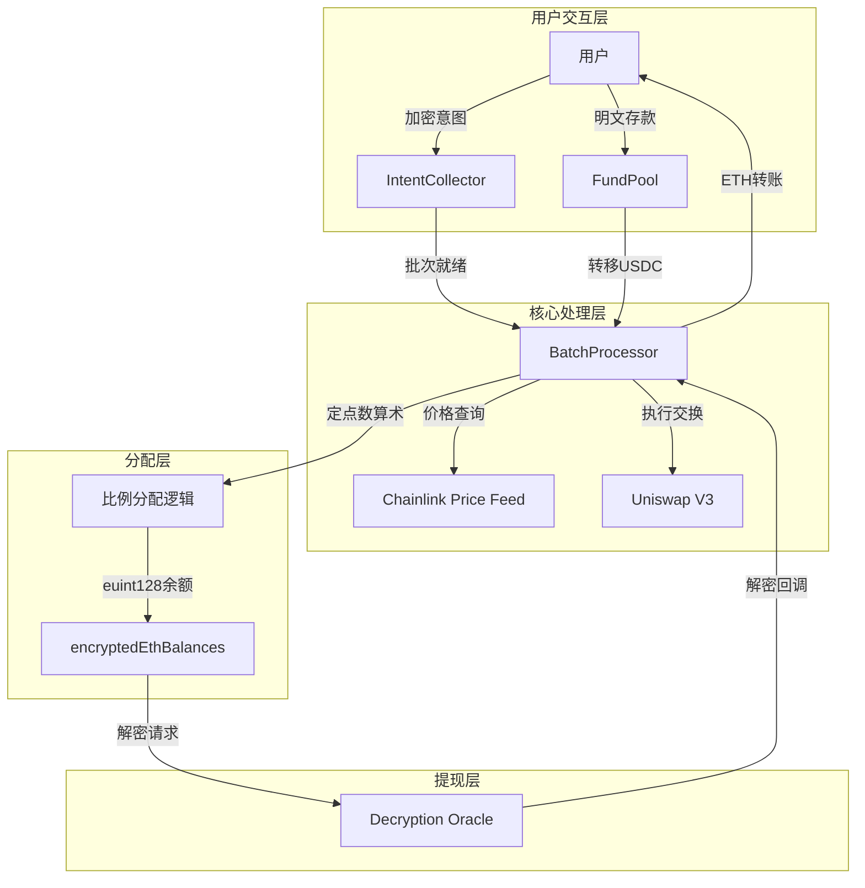

# DCA FHE Bot 系统架构总览

## 更新日期
2025-01-20

## 系统概述

DCA FHE Bot 是一个基于全同态加密（FHE）的隐私保护型定投（DCA）系统，实现了用户投资策略的完全隐私保护，同时通过批处理提供 k-匿名性。

## 核心创新

### 1. 定点数算术比例分配
- **问题**：FHEVM 不支持加密除法
- **解决方案**：使用定点数算术将除法转换为乘法
- **实现**：详见 [ProportionalDistribution.md](./ProportionalDistribution.md)

### 2. 简化的存款机制
- **改进**：移除不必要的 FHE 参数
- **现状**：明文存款，加密策略
- **理由**：合理的隐私与实用性权衡

### 3. 灵活的批处理管理
- **特性**：动态批次大小配置
- **实现**：通过 Chainlink checkData 调整 k-匿名性要求
- **详情**：见 [StateManagementUpdate.md](./StateManagementUpdate.md)

### 4. 安全的提现机制
- **方案**：全额提现 + 解密验证
- **流程**：详见 [WithdrawalMechanism.md](./WithdrawalMechanism.md)

## 系统架构图



## 合约架构

### 核心合约

1. **IntentCollector.sol**
   - 收集加密的 DCA 意图
   - 管理批次和用户状态
   - 实施 k-匿名性规则

2. **BatchProcessor.sol**
   - FHE 价格条件过滤
   - 聚合加密金额
   - 执行 Uniswap 交换
   - **实现定点数算术比例分配**
   - 管理加密 ETH 余额

3. **FundPool.sol**
   - 管理用户 USDC 存款
   - **简化的 deposit 函数**（无 FHE 参数）
   - 全额提现机制

4. **~~ConfidentialToken.sol~~** (已弃用)
   - 原用于加密代币分发
   - 功能已整合到 BatchProcessor

### 接口合约

- **IDecryptionOracle.sol**：Zama 解密服务接口
- **IFundPool.sol**：简化的资金池接口
- **IChainlinkAggregator.sol**：价格预言机
- **IUniswapV3Router.sol**：DEX 路由器

### 测试合约

- **MockDecryptionOracle.sol**：模拟解密服务
- **MockPriceFeed.sol**：模拟价格源
- **MockUniswapRouter.sol**：模拟 DEX

## 关键数据流

### 1. 存款流程
```
用户 → FundPool.deposit(amount) → 更新加密余额 → 激活用户状态
```

### 2. 意图提交
```
用户 → 加密参数 → IntentCollector.submitIntent() → 加入批次
```

### 3. 批处理执行
```
批次就绪 → 价格过滤 → 聚合金额 → Uniswap交换 → 比例分配
```

### 4. 比例分配（核心创新）
```
计算兑换率 = totalETH * 1e27 / totalUSDC
用户份额 = userContribution * 兑换率 (FHE乘法)
存储 encryptedEthBalances[user] (euint128)
```

### 5. 提现流程
```
用户请求 → 解密余额 → 转换缩放值 → 转账ETH
```

## 隐私保护机制

### 保护的信息
- ✅ 个体 DCA 策略参数
- ✅ 用户投资金额（加密）
- ✅ 价格条件（minPrice/maxPrice）
- ✅ 用户获得的 ETH 份额

### 公开的信息
- ⚪ 批次聚合总额
- ⚪ 兑换率（聚合后）
- ⚪ 参与人数
- ⚪ 存款事件（金额可见）

### 隐私保证
- **k-匿名性**：最少 5-10 用户/批次
- **时间分离**：存款与意图提交分离
- **聚合执行**：单次交换隐藏个体

## 技术特性

### FHE 操作
- **类型**：euint32, euint64, euint128
- **运算**：add, sub, mul, select, ge, le
- **限制**：不支持除法（通过定点数算术解决）

### 精度管理
- **SCALING_FACTOR**: 1e18
- **RATE_PRECISION**: 1e27
- **溢出保护**：使用 euint128

### Gas 优化
- 批量处理减少交易数
- 状态过滤避免无效 FHE 操作
- 存储优化使用映射

## 部署指南

### 部署顺序
1. MockERC20 (USDC, WETH)
2. MockPriceFeed
3. MockUniswapRouter
4. FundPool
5. IntentCollector
6. BatchProcessor
7. MockDecryptionOracle (测试)

### 配置关系
```javascript
await intentCollector.setBatchProcessor(batchProcessor);
await batchProcessor.setFundPool(fundPool);
await batchProcessor.setDecryptionOracle(oracle);
await fundPool.setBatchProcessor(batchProcessor);
await fundPool.setIntentCollector(intentCollector);
```

## 测试覆盖

### 单元测试
- ✅ IntentCollector.test.ts
- ✅ BatchProcessor.test.ts
- ✅ FundPool.test.ts
- ✅ ProportionalDistribution.test.ts

### 集成测试
- ✅ DCASystem.test.ts
- ✅ 端到端流程测试

### 性能测试
- ✅ 精度验证
- ✅ 溢出保护
- ✅ Gas 消耗分析

## 已知限制与未来改进

### 当前限制
1. 测试环境使用 mock 解密
2. 需要手动触发批处理（Chainlink Automation 可选）
3. 固定滑点容忍度

### 计划改进
1. 集成真实 Zama 解密服务
2. 动态滑点调整
3. 更复杂的价格条件（如"买跌"策略）
4. 跨链支持

## 安全审计状态

详见 [SecurityAudit.md](./SecurityAudit.md)

### 已解决
- ✅ 比例分配机制
- ✅ 存款简化
- ✅ 解密 Oracle 接口

### 待解决
- ⚠️ 生产环境解密服务集成
- ⚠️ ZK 证明验证
- ⚠️ 移除测试函数

## 相关文档

- [ProportionalDistribution.md](./ProportionalDistribution.md) - 定点数算术方案详解
- [WithdrawalMechanism.md](./WithdrawalMechanism.md) - 提现机制设计
- [StateManagementUpdate.md](./StateManagementUpdate.md) - 状态管理系统
- [SecurityAudit.md](./SecurityAudit.md) - 安全审计报告

## 联系与贡献

- GitHub: [DCA_FHE_BOT](https://github.com/your-repo)
- 问题反馈：Issues
- 贡献指南：CONTRIBUTING.md

---

**版本**: v2.0.0  
**最后更新**: 2025-01-20  
**主要贡献者**: Development Team