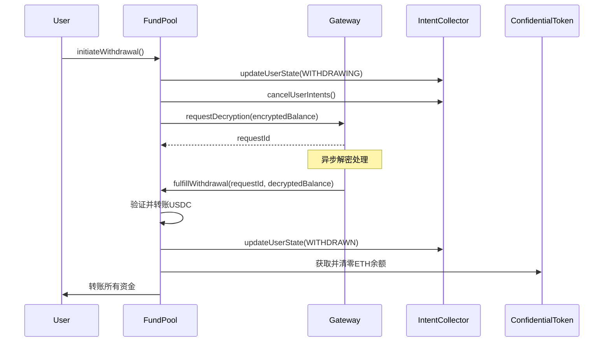

# 全额提现机制设计文档

## 执行摘要

本文档详细说明了DCA FHE Bot系统中实现的安全全额提现机制。该机制通过集成Zama Gateway解密服务，解决了原系统中提现缺少真实余额验证的高危漏洞（H-1），实现了安全、透明且保护隐私的资金提取流程。

## 设计原则

### 核心理念
1. **全额提现**：用户一次性提取所有余额，简化验证逻辑
2. **解密验证**：通过可信的解密服务验证真实余额
3. **状态同步**：确保跨合约状态一致性
4. **用户友好**：提供清晰的状态查询和错误处理

### 安全目标
- 防止超额提现
- 防止重入攻击
- 防止竞态条件
- 保护用户隐私

## 技术架构

### 组件交互图



## 详细实现

### 1. 提现请求结构

```solidity
struct WithdrawalRequest {
    uint256 requestId;        // Gateway请求ID
    address user;             // 请求用户
    euint64 encryptedBalance; // 加密余额快照
    uint256 timestamp;        // 请求时间戳
    bool fulfilled;           // 是否已完成
    bool cancelled;           // 是否已取消
}
```

### 2. 提现流程

#### 阶段1：发起提现

```solidity
function initiateWithdrawal() external {
    // 前置检查
    require(isBalanceInitialized[msg.sender], "未初始化");
    require(activeWithdrawalRequest[msg.sender] == 0, "已有请求");
    require(cooldownPassed(), "冷却期未过");
    
    // 状态更新
    updateUserState(WITHDRAWING);
    cancelAllIntents();
    
    // 请求解密
    requestId = gateway.requestDecryption(encryptedBalance);
    
    // 记录请求
    storeWithdrawalRequest(requestId);
}
```

#### 阶段2：解密回调

```solidity
function fulfillWithdrawal(uint256 requestId, uint256 decryptedBalance) external {
    // 权限验证
    require(msg.sender == gateway, "只允许Gateway调用");
    
    // 请求验证
    WithdrawalRequest storage request = withdrawalRequests[requestId];
    require(!request.fulfilled && !request.cancelled, "无效请求");
    
    // 余额验证
    require(poolBalance >= decryptedBalance, "池子余额不足");
    
    // 执行转账
    executeTransfer(request.user, decryptedBalance);
    
    // 状态清理
    resetUserBalances();
    updateUserState(WITHDRAWN);
}
```

#### 阶段3：状态重置

```solidity
function resetUserState(address user) internal {
    // FundPool余额重置
    encryptedBalances[user] = FHE.asEuint64(0);
    isBalanceInitialized[user] = false;
    
    // ConfidentialToken余额重置
    confidentialToken.resetBalance(user);
    
    // 清除活跃请求
    delete activeWithdrawalRequest[user];
    
    // 更新时间戳
    lastWithdrawalTime[user] = block.timestamp;
}
```

### 3. 安全机制

#### 冷却期保护
```solidity
uint256 constant WITHDRAWAL_COOLDOWN = 24 hours;

modifier cooldownCheck() {
    require(
        block.timestamp - lastWithdrawalTime[msg.sender] >= WITHDRAWAL_COOLDOWN,
        "冷却期未结束"
    );
    _;
}
```

#### 重入保护
```solidity
modifier nonReentrant() {
    require(!locked, "重入保护");
    locked = true;
    _;
    locked = false;
}
```

#### 权限控制
```solidity
modifier onlyGateway() {
    require(msg.sender == address(withdrawalGateway), "未授权");
    _;
}
```

## 边界情况处理

### 1. 并发批处理
**问题**：用户在批处理执行期间发起提现
**解决**：
- 批处理检查用户状态，跳过WITHDRAWING用户
- FHE.select()作为后备机制处理余额不足

### 2. Gateway故障
**问题**：解密服务不可用
**解决**：
- 提供取消机制允许用户退出等待
- 实施超时自动取消（72小时）
- 紧急提现通道（需要治理批准）

### 3. 部分失败
**问题**：USDC转账成功但ETH转账失败
**解决**：
- 使用try-catch包装转账
- 失败时回滚所有状态变更
- 记录失败事件供手动处理

## 用户体验优化

### 1. 状态查询函数

```solidity
function canWithdraw(address user) external view returns (
    bool canWithdraw,
    string memory reason
) {
    if (!isBalanceInitialized[user]) 
        return (false, "未初始化");
    if (activeWithdrawalRequest[user] != 0) 
        return (false, "有待处理请求");
    if (cooldownActive(user)) 
        return (false, "冷却期");
    return (true, "");
}
```

### 2. 进度查询

```solidity
function getWithdrawalStatus(address user) external view returns (
    bool pending,
    uint256 requestId,
    uint256 estimatedTime
) {
    // 返回提现状态和预计完成时间
}
```

### 3. 取消机制

```solidity
function cancelWithdrawal() external {
    // 允许用户取消待处理的提现
    // 恢复到ACTIVE状态
    // 重新激活意图（可选）
}
```

## 重新激活流程

用户完成提现后如何重新参与：

1. **重新存款**
   ```solidity
   deposit() → 自动激活状态 → 可以提交新意图
   ```

2. **状态流转**
   ```
   WITHDRAWN → deposit() → ACTIVE → 正常DCA流程
   ```

3. **历史清理**
   - 旧意图保持已处理状态
   - 新意图获得新的ID
   - 批次计数继续递增

## 性能考虑

### Gas优化
1. **批量处理**：聚合多个提现请求的解密
2. **状态打包**：优化存储槽使用
3. **事件优化**：减少不必要的事件发射

### 扩展性
1. **并发限制**：每批最多处理10个提现
2. **队列机制**：高峰期自动排队
3. **优先级系统**：大额用户可选优先处理

## 监控与告警

### 关键指标
- 提现请求数量
- 平均处理时间
- 失败率
- Gateway响应时间

### 告警阈值
- 单日提现超过TVL的20%
- Gateway响应时间超过5分钟
- 连续3次提现失败
- 异常大额提现（>$100k）

## 安全审计要点

### 必须验证
1. ✅ Gateway回调的真实性
2. ✅ 解密值与实际余额的一致性
3. ✅ 状态转换的原子性
4. ✅ 重入攻击防护
5. ✅ 整数溢出保护

### 测试场景
```javascript
describe("Withdrawal Security", function() {
    it("Should prevent withdrawal without balance");
    it("Should enforce cooldown period");
    it("Should handle Gateway timeout");
    it("Should prevent double withdrawal");
    it("Should sync state across contracts");
});
```

## 与批处理的交互

### 自动处理机制
1. 批处理前检查用户状态
2. 过滤WITHDRAWING/WITHDRAWN用户
3. 无需显式锁定或暂停

### 优势
- 无需复杂的同步机制
- 自然的最终一致性
- 减少了系统复杂度

## 合规性考虑

### KYC/AML
- 大额提现触发额外验证
- 可选的身份验证层
- 审计追踪保留

### 监管报告
- 所有提现记录链上可查
- 支持导出报告
- 时间戳和金额追踪

## 实施时间表

### Phase 1: 基础实现（1周）
- [x] IWithdrawalGateway接口
- [x] FundPool提现函数
- [x] 状态管理集成

### Phase 2: 安全加固（2周）
- [ ] Gateway集成测试
- [ ] 异常处理完善
- [ ] 安全审计

### Phase 3: 优化体验（1个月）
- [ ] 批量提现支持
- [ ] 优先级队列
- [ ] UI集成

## 总结

全额提现机制的实现解决了系统的核心安全问题，通过解密验证确保了资金安全，同时保持了用户隐私。结合状态管理系统，整个提现流程变得高效、安全且用户友好。这一机制为DCA FHE Bot的生产部署奠定了坚实基础。

---

**相关文档**
- [状态管理系统更新](./StateManagementUpdate.md)
- [安全审计报告](./SecurityAudit.md)
- [漏洞修复建议](./VulnerabilityFixes.md)